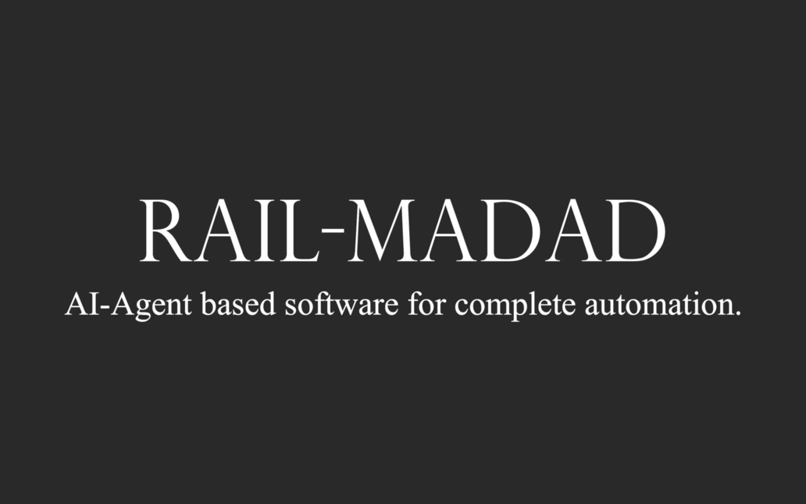

# SIH 1711
AI-driven autonomous workflow for automating railway complaint management.

### Library installations: 
```bash
pip install -r requirements.txt
```
### To see the minimal User interface run: 
```bash
streamlit run app.py
```
#### in local environment in .env assign: 
GEMINI_MODEL_NAME=gemini-1.5-flash

GEMINI_API_KEY="your api key"

step by step guide to obtain free api-key: [Get API key](https://www.linkedin.com/pulse/step-by-step-guide-using-google-gemini-free-api-calls-image-text-y3noc/)

RAPID_API_KEY="your_api_key" 
Link: https://rapidapi.com/rahilkhan224/api/indian-railway-irctc/playground

## Gallery:


## Video describing the features: 
[](https://www.youtube.com/watch?v=Ts_lwYFlMB4)
